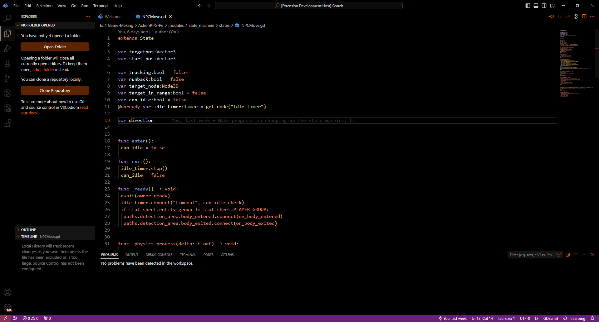

<body>
 <body style="background-color:black;color:grey">

<h1>Makkuro</h1>

<h2>Screenshots</h2>

 

<h2>Info</h2>

Oled dark theme I made because I wanted to make my own theme.
 I personally love OLED themes but none of the available ones really clicked with me,
 besides I wanted to try making my own regardless.

VSCode themes are a pain to make, however <a href="https://github.com/microsoft/vscode-generator-code">Yo Code</a>
makes the intial setup extremely bearable.

</body>