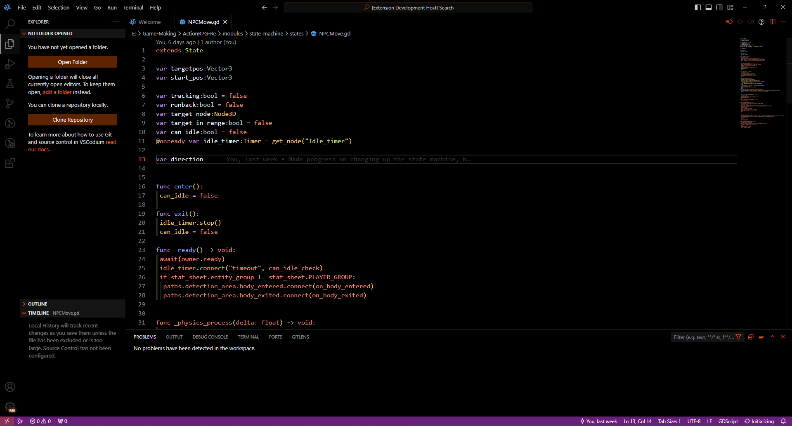

# Makkuro 

## Screenshots

## Info
Oled dark theme I made because I wanted to make my own theme.
 I personally love OLED themes but none of the available ones really clicked with me, besides I wanted to try making my own regardless.

I will be changing this theme up a bit whenever I find something that I'd like to change.  
Whenever I find the time and motivation I'll likely port this theme over to other things I use, those ports will be linked across repos.  
However currently I still have to establish a solid colour palette.

VSCode themes are a pain to make, however <a href="https://github.com/microsoft/vscode-generator-code">Yo Code</a>
makes the intial setup extremely bearable.

